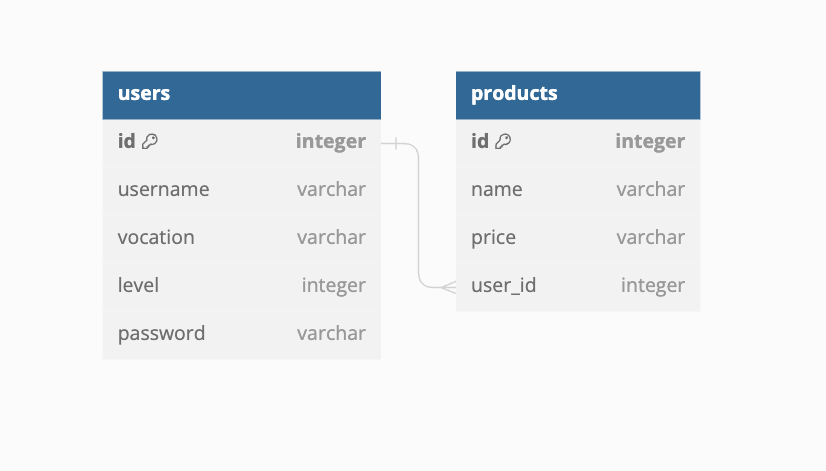

# Boas vindas ao repositório do projeto Trybesmith

  
<strong>👨‍💻 O que foi desenvolvido:</strong>

Para este projeto, foi criado uma loja de itens medievais, como aquelas espadas feitas sob encomenda para uma pessoa específica, no formato de uma _API_, utilizando _Typescript_ e _Sequelize_.

Desenvolvido as camadas de _Service_ e _Controllers_ da aplicação em seu código, utilizando _JWT_ para autenticar algumas rotas, além de testes para garantir o correto funcionamento delas. A aplicação terá _endpoints_ que darão suporte a operações de criação, leitura e atualização de informações.

---

  
<strong>🎲 Diagrama Entidade Relacionamento do projeto</strong>

  O banco de dados do projeto segue a estrutura abaixo:  

  

